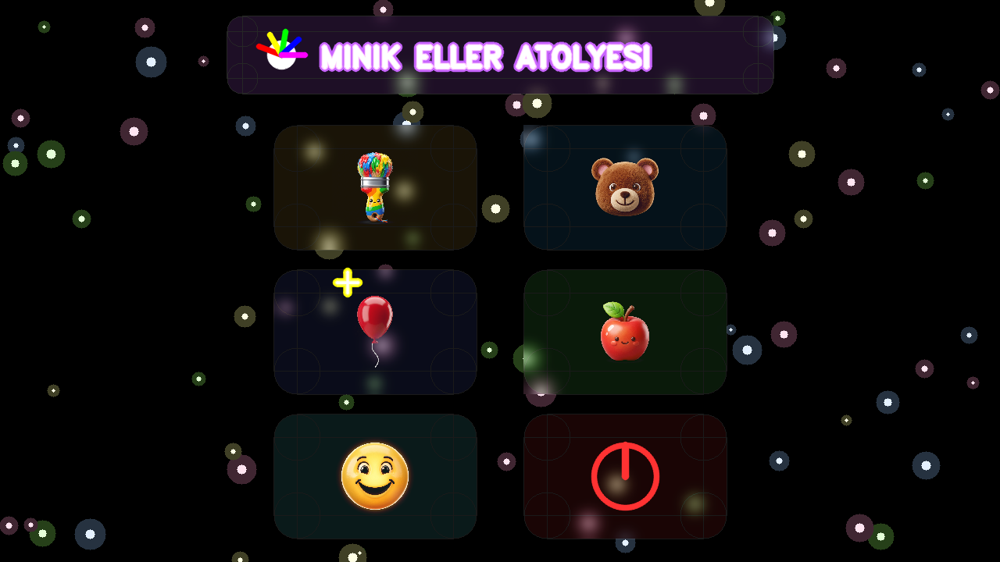
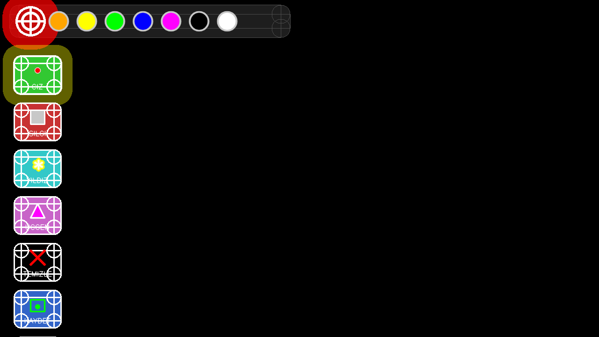

# 📄 Ara Sınav Proje Raporu: Minik Eller Atölyesi

## 1. Giriş

### 1.1. Projenin Amacı ve Kapsamı
**Minik Eller Atölyesi**, okul öncesi dönemdeki çocukların (3-6 yaş) motor becerilerini geliştirmeyi amaçlayan, yapay zeka destekli temassız bir dijital sanat ve oyun platformudur.

*   **Hangi Problemi Çözüyor?** Geleneksel ekran kullanımı çocukları pasif ve hareketsiz bırakmaktadır. Bu proje, çocukların ekrana dokunmadan, ellerini ve vücutlarını havada hareket ettirerek etkileşime girmesini sağlar. Böylece dijital oyun süreci fiziksel bir aktiviteye dönüşür.
*   **Kimler Kullanacak?** Okul öncesi çocuklar, anaokulu öğretmenleri ve aileler.
*   **Sınırlar:** Tek kamera (RGB) üzerinden el ve vücut takibi yapar, düşük donanımlı cihazlarda dahi akıcı çalışacak şekilde optimize edilmiştir.

### 1.2. Motivasyon
Çocukların teknolojiyle olan ilişkisini "pasif izleyicilikten" çıkarıp "aktif üreticiliğe" dönüştürmek temel motivasyonumuzdur. Mevcut uygulamaların fiziksel hareket kısıtlılığına bir çözüm olarak, MediaPipe teknolojisinin sağladığı imkanları pedagojik bir yaklaşımla birleştirdik.

---

## 2. Kullanılan Yazılım Araçları ve Teknolojiler

### 2.1. Programlama Dili ve Framework
*   **Python:** Yapay zeka modelleri (MediaPipe) ve görüntü işleme kütüphaneleriyle olan mükemmel uyumu nedeniyle tercih edilmiştir.

### 2.2. Veritabanı
*   **File-Based Local Storage:** Projede karmaşık bir veritabanı yerine, çocukların yaptığı eserlerin PNG formatında tarih damgalı olarak saklandığı bir yerel dosya sistemi kullanılmıştır. Bu, okul ortamlarında internet bağımlılığını ortadan kaldırır.

### 2.3. Diğer Araçlar ve Kütüphaneler
*   **OpenCV:** Görüntü yakalama ve grafik arayüz (GUI) oluşturma.
*   **MediaPipe Tasks API:** El ve vücut landmark tespiti için kullanılan derin öğrenme modelleri.
*   **NumPy:** Yüksek performanslı matris işlemleriyle çizim katmanlarının yönetimi.

### 2.4. Geliştirme Ortamı ve Versiyon Kontrolü
*   **IDE:** Visual Studio Code.
*   **Versiyon Kontrol:** Git & GitHub.
*   **Repo Linki:** [https://github.com/A-s-i-y-e/MinikEller_Atolyesi](https://github.com/A-s-i-y-e/MinikEller_Atolyesi)

---

## 3. Sistem Mimarisi ve Teknik Tasarım

### 3.1. Genel Mimari
Uygulama **Modüler Katmanlı Mimari** kullanılarak geliştirilmiştir:

| Katman | Sorumluluk | İlgili Dosya |
| :--- | :--- | :--- |
| **Giriş (Input)** | Kamera akışı ve görüntü ön işleme | `main.py` |
| **Tespit (Detection)** | AI modelleriyle el/vücut koordinat tespiti | `hand_detector.py`, `pose_detector.py` |
| **Mantık (Logic)** | Koordinatların jeste dönüştürülmesi | `hand_detector.py` (detect_gesture) |
| **Arayüz (UI/UX)** | Neon efektler ve görsel geribildirim | `ui_engine.py`, `menu.py` |




---

## 4. Uygulamanın İşlevselliği

### 4.1. Temel Özellikler ve Kullanıcı Senaryoları

#### 4.1.1. Özellik: El Jesti ile Serbest Çizim
Kullanıcı işaret parmağını (☝️) kaldırarak çizim moduna geçer. Havada parmağını hareket ettirerek neon fırçalarla resim yapabilir.


#### 4.1.2. Özellik: Sihirli Şablon Boyama
Ekranda beliren hazır şablonların (Ayı, Araba vb.) üzerine gelindiğinde, uygulama alanı otomatik olarak algılar ve çocukların "taşırmadan" boyama yapmasını sağlar.


#### 4.1.3. Özellik: Eğitici Oyunlar (Balon Patlatma ve Elma Yakala)
*   **Balon Patlatma:** El koordinasyonunu artırır.
*   **Elma Yakala:** Vücut hareketlerini (Pose) kullanarak fiziksel aktivite sağlar.


---

## 5. Kod Kalitesi ve Yazılım Geliştirme Pratikleri

### 5.1. Kod Organizasyonu ve Okunabilirlik
Proje, anlamlı isimlendirme ve PEP8 standartlarına uygun yazılmıştır.

**Kod Örneği 1: Jest Algılama Mantığı**
```python
# hand_detector.py içinden
def _detect_gesture_for_hand(self, lms_px):
    s = self._get_finger_states_for_hand(lms_px)
    thumb, index, middle, ring, pinky = s

    if index and not middle and not ring and not pinky: return 'draw'    # ☝️ Çizim
    elif index and middle and not ring and not pinky: return 'erase'    # ✌️ Silme
    elif thumb and index and middle and ring and pinky: return 'clear'  # 🖐️ Temizle
```

**Kod Örneği 2: Neon Efekt Motoru**
```python
# ui_engine.py içinden
def draw_neon_text(img, text, x, y, font, scale, color):
    # Dış parlama (Glow)
    cv2.putText(img, text, (x, y), font, scale, color, 10, cv2.LINE_AA)
    # Parlak iç çekirdek (Core)
    cv2.putText(img, text, (x, y), font, scale, (255, 255, 255), 2, cv2.LINE_AA)
```

---

## 6. Sonuç ve Gelecek Çalışmalar

### 6.1. Elde Edilen Sonuçlar
Proje, hedeflenen tüm işlevleri (temassız çizim, oyunlar, şablonlar) başarıyla yerine getirmektedir. Çocukların fiziksel hareketliliğini artırma hedefi, test sürecinde el ve vücut koordinasyonunun aktif kullanımıyla doğrulanmıştır.

### 6.2. Karşılaşılan Zorluklar ve Sınırlılıklar
*   **Sınırlılık:** MediaPipe, yetersiz ışık ortamlarında el landmarklarını takip etmekte zorlanabilmektedir.
*   **Çözüm:** Görüntüye uygulanan `CLAHE` (Kontrast Sınırlı Adaptif Eşikleme) algoritmasıyla düşük ışık performansı artırılmıştır.

### 6.3. Geliştirme Önerileri
*   **Gelecek Çalışma:** Çok oyunculu (multiplayer) modu ile iki çocuğun aynı ekranda iş birliği içinde çizim yapması.
*   **Gelecek Çalışma:** Çizilen eserlerin bulut sistemine (Firebase vb.) otomatik yedeklenmesi.
